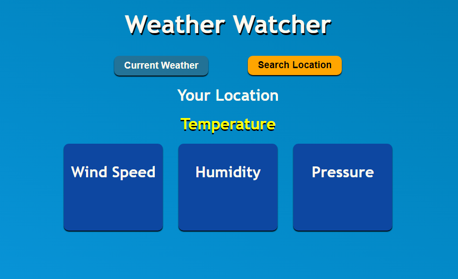

# WeatherWatcher 🌤️

WeatherWatcher is a simple web app where users can check the weather for any city and state within India. Additionally, users can click the "Your Weather" button, which requests location permission to display the current weather based on the user's geolocation.

## Features
- 🌍 **Search Weather by City and State**: Enter any Indian city and state to get up-to-date weather information.
- 📍 **Geolocation Support**: Allow location access to automatically fetch the current weather for your location.
- 🌦️ **Real-Time Updates**: Displays real-time temperature, humidity, and weather conditions.

## Demo
Try it out here: [WeatherWatcher Live Demo](https://weather-watcher-new.vercel.app/)

## Screenshots

## Usage

- **Check Weather by City**: Enter the city and state name (e.g., `Delhi, Delhi`) and click the "Get Weather" button.
- **Your Weather**: Click the "Your Weather" button to allow location access and view your current location's weather.

## Technologies Used
- HTML
- CSS
- JavaScript

## Contributing

Contributions are welcome! Follow these steps:

1. Fork the project.
2. Create your feature branch (`git checkout -b feature/your-feature`).
3. Commit your changes (`git commit -m 'Add new feature'`).
4. Push to the branch (`git push origin feature/your-feature`).
5. Open a pull request.

## License
This project is licensed under the MIT License. See the [LICENSE](LICENSE) file for details.

---

Happy coding! 🌧️☀️
